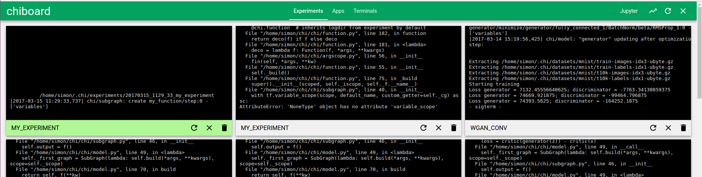
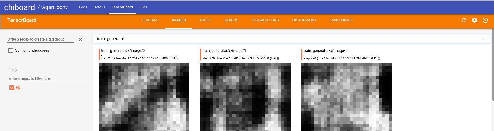

### CHI --- Tools for advanced* deep learning with TensorFlow

*fjdkslafjkdsla

--------------------------


### Guiding principles

- __No boilerplate.__ Minimize the amount of overhead when writing [experiment scripts](examples/c_experiments.py), defining [models](examples/b_models.py) and running [tensorflow functions](examples/a_functions.py).

- __Flexibility.__ Models are arbitrary TensorFlow (sub-)graphs and multiple models can be trained at the same time with respect to each other which is the basis for actor-critic systems and adversarial training.

- __Compliance__. Everything is built and compliant with standard tensorflow mechanisms such as *scopes*, *collections* and the *[keras layers API](https://www.tensorflow.org/api_guides/python/contrib.layers)*.

- __Separate models and algorithms.__ 


---------------------------

### Getting started


__Building and Running TensorFlow Graphs__. This in one step by writing a normal graph builder function and wrapping it with `chi.function`:

```python
@chi.function
def my_tf_fun(x, y):
  z = tf.nn.relu(x) * y
  return z
```

That automatically builds the graph and creates placeholders for x and y. To compute `z` just call `my_tf_fun(3, 5)  # returns 15.0 `. It is also possible to specify shape and dtype of the parameters. See [examples/functions.py for more](expamples/functions.py).


__Defining Models__ works similarly, except that the builder function remains a builder function that automatically shares weights.

```python
@chi.model
def my_model(x: (None, 28*28)):  # specifies shape as (None, 28*28)
  x = layers.fully_connected(x, 100)
  z = layers.fully_connected(x, 10, None)
  p = layers.softmax(z)
  return z, p
```


See [examples/models.py for the full example (classifying hand-written digits)](examples/models.py).

__Experiment Scripts__ can also be defined via decorator. When run from the command line the function arguments are translated into command line parameters.
```python

```
See [examples/experiments.py for the full example](examples/experiments.py)

For a more advanced example see the [Wasserstein GAN example](/examples/wgan.py).

--------------------------

### Visualization with CHIBOARD
Chiboard is a web-based dashboard for managing experiments. Start it with `chiboard`.



Clicking on an experiment card leads to a detail page about that experiment which automatically spins up and embeds a TensorBoard:



See [chi/board for a full overview](chi/board).

--------------------------

### Installation

Requires Python 3.6

```
git clone git@github.com:rmst/chi.git
pip install -e ./chi
```

---------------------------


### Acknowledgements

The foundations for this work have been developed during projects at the following institutes.

- Reasoning and Learning Lab (RLLab) at McGill University in Canada
- Montreal Institute for Learning Algorithms (MILA) in Canada
- Intelligent Autonomous Systems Lab (IAS) at TU-Darmstadt in Germany

The structures of this repo and readme were inspired by [Keras-RL](https://github.com/matthiasplappert/keras-rl) and [Keras](https://github.com/fchollet/keras) respectively.

