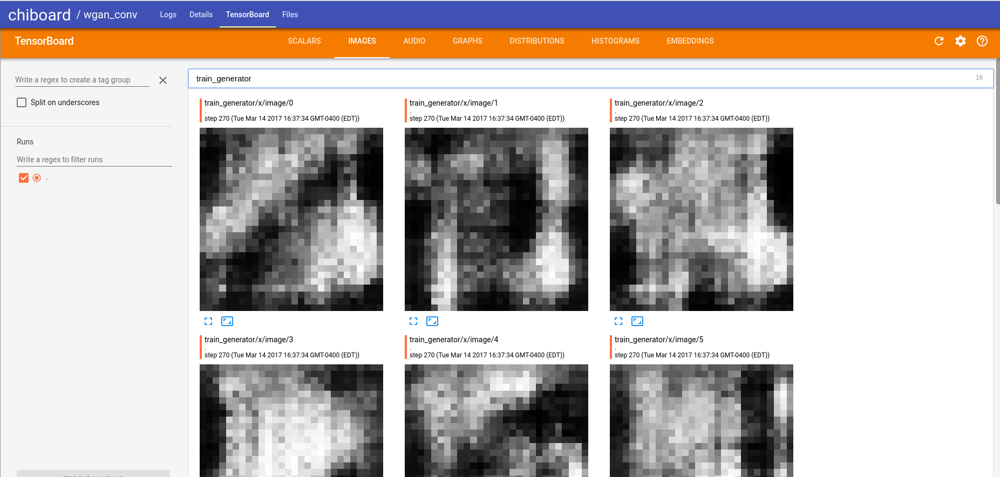

### CHIBOARD

#### Running Chiboard

```
chiboard --deamon
```

will run chiboard in the background. Logs can be watched from chiboard (under apps). Chiboard can be stopped by clicking the X in the top right of the page.


#### Experiments Overview


#### Detailed Experiment Page


TensorBoard will automatically spin up if an event file is present in the experiment folder. It will shutdown after a certain time in which the detail page of that experiment hasn't been accessed. 


#### Structure of an Experiment Logdir

```
experiments-dir  (by default ~/.chi/experiments, change it via the environment variable `CHI_EXPERIMENTS`)
	|
	- my_experiment
		|
		- chi_experiment.json  (The experiment config file. Necessary)
		|
		- \*.event.\*  (a TensorFlow event file)
		|
		- logs  (Contains text files that will be displayed in chiboard)
			|
			- stdout
			- other_log
```